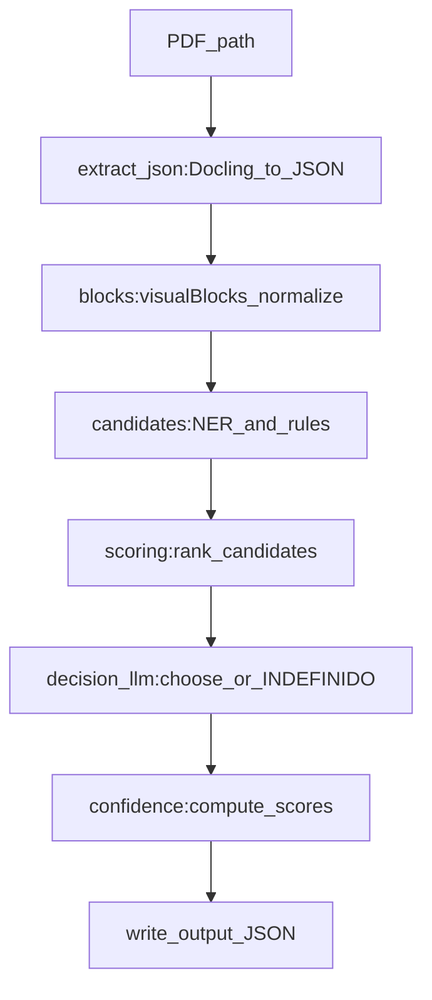

# Pipeline local/offline: extração de funcionário e empresa

## Escopo

- Implementar o projeto do zero na estrutura proposta.
- Usar **Docling pipeline padrão** para PDF→JSON; **sem instalar OCR externo**. Quando o PDF exigir OCR e o Docling não entregar texto útil, o sistema deve **falhar de forma segura** retornando `INDEFINIDO`.
- Garantir execução **100% offline** (sem HTTP), determinística (parâmetros fixos, seed, temperatura 0) e tolerante a OCR/layout variável.

## Estrutura e arquivos

- Criar:
  - [`main.py`](main.py) orquestração CLI e gravação do output.
  - [`config.py`](config.py) configurações (paths, thresholds, parâmetros do LLM, flags de debug, seed).
  - `pipeline/` com:
    - [`pipeline/extract_json.py`](pipeline/extract_json.py) Docling→JSON normalizado.
    - [`pipeline/blocks.py`](pipeline/blocks.py) normalização de blocos (texto, bbox, página, y_norm, id estável).
    - [`pipeline/candidates.py`](pipeline/candidates.py) geração de candidatos (funcionário/empresa) usando spaCy + regras fracas.
    - [`pipeline/scoring.py`](pipeline/scoring.py) heurísticas acumulativas e ranking.
    - [`pipeline/decision_llm.py`](pipeline/decision_llm.py) decisão final com llama-cpp-python (JSON estrito, escolha apenas entre candidatos).
    - [`pipeline/confidence.py`](pipeline/confidence.py) cálculo de confidence baseado em margem, redundância e confirmação do LLM.
  - `models/` (sem download em runtime): modelo GGUF já presente.
  - `examples/` (PDFs de exemplo fornecidos pelo usuário; não gerar binário no código).
  - `output/` outputs JSON.
  - `README.md` com setup offline e uso.
  - `requirements.txt` (pin de versões) para Python 3.11.
  - `tests/` com `pytest` e casos sintéticos (sem PDFs binários no repo; usar mocks do JSON do Docling e snapshots).

## Decisões de implementação (determinismo e offline)

- **Sem chamadas externas**: bloquear por design (não importar libs que “telefonem para casa”; não usar downloads automáticos).
- **spaCy pt_core_news_lg**: instruir no README que o modelo deve ser instalado previamente (offline) e não baixado em runtime.
- **LLM** (llama.cpp):
  - `temperature=0`, `top_p=1`, `top_k=0` (ou default determinístico), `seed` fixo.
  - `max_tokens` baixo e **JSON schema** simples.
  - Prompt “closed-book”: proibido inventar; só pode selecionar um item por lista ou `INDEFINIDO`.

## Fluxo do pipeline

## Implementação por etapa

### 1) Docling → JSON (`pipeline/extract_json.py`)

- Função pública: `extract_docling_json(pdf_path: str) -> dict`.
- Normalizar estrutura mínima (páginas, blocos/itens com texto e bbox quando existirem).
- Detectar “texto insuficiente” (ex.: poucos caracteres úteis) e marcar no retorno um flag `extraction_quality` para permitir fallback seguro (retornar `INDEFINIDO` adiante).

### 2) Blocos (`pipeline/blocks.py`)

- Criar dataclass `Block` com:
  - `id` determinístico (hash curto de page+index+bbox), `page`, `text`, `bbox` (x0,y0,x1,y1), `y_norm`.
- Extrair `y_norm` como posição vertical normalizada do topo do bloco na página.

### 3) Candidatos (`pipeline/candidates.py`)

- Funcionário:
  - spaCy NER `PER` + regras: 2–3 palavras, Title Case, filtros de stopwords/prefixos (Dr/Dra/CPF/RG etc.).
- Empresa:
  - padrões (LTDA, S/A, ME, EPP, EIRELI, “INDÚSTRIA”, “COMÉRCIO”) + heurísticas de caixa alta/Title Case + priorizar blocos no topo.
- Saída:
  - `{"funcionarios": [{"text","block_id","page"}], "empresas": [...]}`

### 4) Scoring (`pipeline/scoring.py`)

- Implementar um score aditivo com pesos em `config.py`:
  - proximidade de palavras‑chave (“Empregador”, “Funcionário”, “Nome”, “Razão Social”, “CNPJ”, etc.) no mesmo bloco e em blocos próximos;
  - frequência de ocorrência do mesmo texto (normalizado);
  - posição (topo do documento favorece empresa);
  - comprimento e “forma” (evitar strings muito longas/curtas).
- Produzir ranking estável (desempate por score, depois por ordem de aparecimento).

### 5) Decisão LLM (`pipeline/decision_llm.py`)

- Carregar modelo GGUF local de `models/`.
- Enviar apenas:
  - top‑K candidatos (ex.: 5) para funcionário e empresa;
  - contexto mínimo (opcional): 2–3 blocos mais relevantes para cada lado.
- Exigir resposta **JSON estrita** com chaves `funcionario` e `empresa`, cada uma sendo exatamente um candidato fornecido ou `INDEFINIDO`.
- Validar e corrigir: se o JSON vier inválido ou com valor fora das opções, forçar `INDEFINIDO`.

### 6) Confidence (`pipeline/confidence.py`)

- Basear em:
  - margem `top1-top2` (normalizada);
  - confirmação do LLM (escolheu top1 vs escolheu outro vs indeciso);
  - presença do texto em múltiplos blocos/páginas.
- Retornar `0.0–1.0` e zerar/baixar em casos de inconsistência.

### 7) Orquestração (`main.py`)

- CLI: `python main.py --pdf examples/sample.pdf --out output/result.json`.
- Fluxo:
  - extrai JSON; gera blocos; candidatos; scoring; decisão LLM; confidence; salva JSON final.
- Garantir que erros (Docling/LLM/spaCy) resultem em `INDEFINIDO` e `confidence` baixa, sem crash.

## Testes

- `pytest` com:
  - testes unitários para:
    - normalização de texto e filtros;
    - scoring determinístico;
    - validação do JSON do LLM (inclui casos de resposta inválida);
  - testes de integração usando **fixtures de JSON do Docling** (sem PDFs) representando layouts variados e OCR ruim.

## Entregáveis finais

- Projeto rodando offline em Windows (Python 3.11), com README de setup.
- Saída no formato:
  - `{"funcionario":"...|INDEFINIDO","empresa":"...|INDEFINIDO","confidence":{"funcionario":0.0,"empresa":0.0}}`